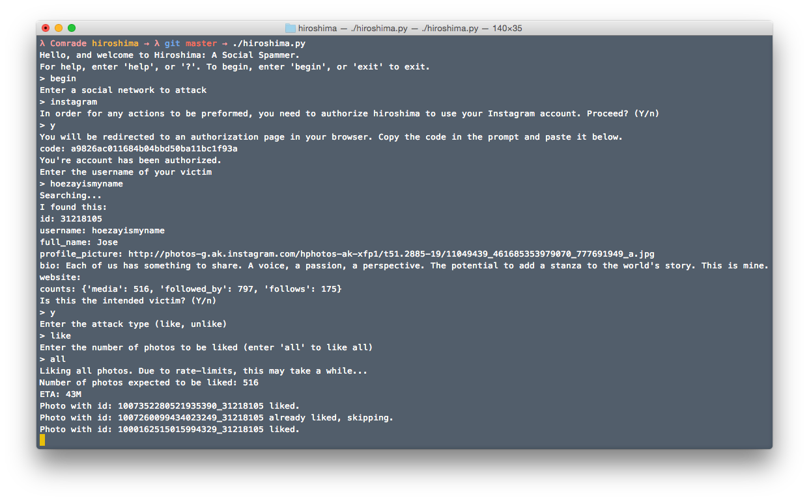

# Hiroshima
### What is Hiroshima?
Hiroshima is an all-in-one spammer program. 

### What's being worked on right now
Hiroshima supports the following (checked means that the feature is active, and properly functing. Un-checked is in development, or being looked into):

- [ ] SMS Bombing
- [x] Instagram Likes
- [ ] ~~Instagram Comments~~1
- [ ] ~~Twitter Mentions/Send Tweet~~2
- [x] Twitter Favorite
- [ ] Twitter Reply
- [x] Twitter Retweet (Experimental)
- [ ] YouTube Likes
- [ ] YouTube Comments
- [ ] Kik messaging
- [ ] Snapchat 
- [x] ask.fm queries

Have a suggestion? Open an issue!

1As of this commit, Instagram allows for only *approved* clients to comment on media.

2Twitter doesn't allow for two like tweets to be tweeted (throws duplication error)

### Screenshots

Instagram video demo [here](https://www.youtube.com/watch?v=-xFVXAt4lMY)
Twitter video demo [here](https://youtu.be/oP5qb-41n8c)

### TODO
* Store access tokens in preference file (so authorization isn't required eachtime)

### Dependencies:
* Mechanize
* tweepy
* python-instagram
* webbrowser

Hiroshima has only been tested/designed for Mac OS X
