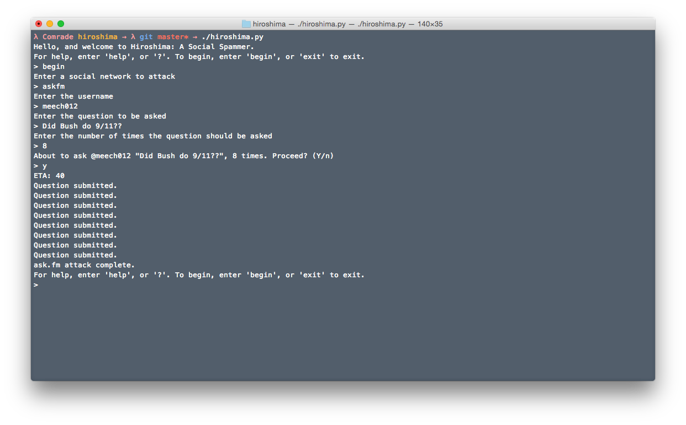

# Hiroshima
### What is Hiroshima?
Hiroshima is a all-in-one spammer program. 

### What's being worked on right now
Hiroshima is in very early development and currently only supports Ask.fm. In future releases features we hope to include are:

- [ ] SMS Bombing
- [x] Instagram Likes
- [ ] ~~Instagram Comments~~1
- [ ] ~~Twitter Mentions/Send Tweet~~2
- [x] Twitter Favorite
- [ ] Twitter Reply
- [ ] YouTube Likes
- [ ] YouTube Comments
- [ ] Kik messaging
- [ ] Snapchat 
- [x] ask.fm queries

1As of this commit, Instagram allows for only *approved* clients to comment on media.
2Twitter doesn't allow for two like tweets to be tweeted (throws duplication error)

### Screenshots

Video demo [here](https://www.youtube.com/watch?v=-xFVXAt4lMY)

### TODO
* create one interactive interface to all spammers
* add mechanize installation to install.sh

### Dependencies:
* Mechanize
* tweepy
* python-instagram
* webbrowser

Hiroshima has only been tested/designed for Mac OS X
